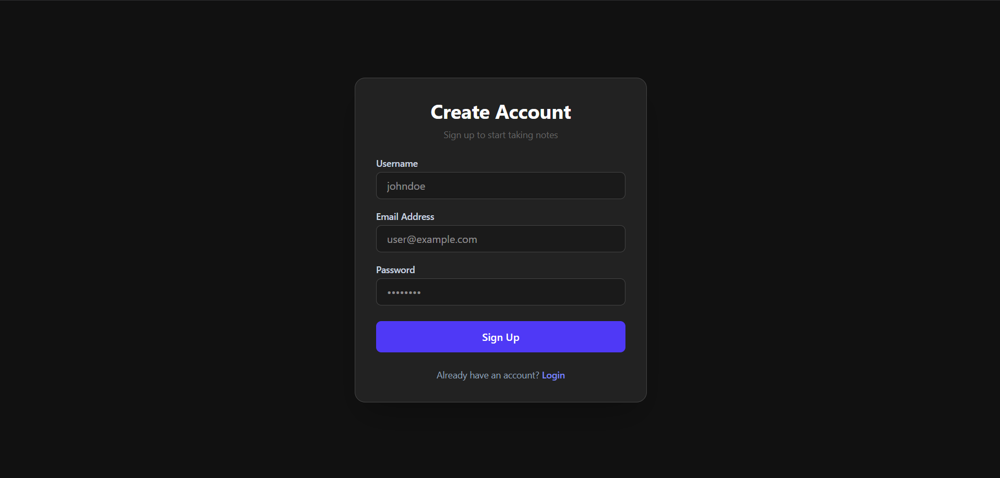
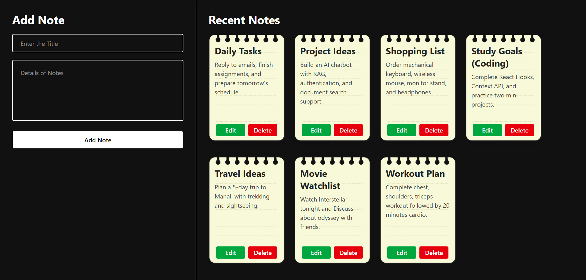

# Notes App

A full-stack Notes Management application built with the MERN Stack, featuring secure JWT authentication, complete CRUD functionality, responsive UI, and seamless REST API integration.

- 🔗 **Live Demo:** [hyper-notes-app.vercel.app](https://hyper-notes-app.vercel.app)
---

## ✨ Features

- 🔐 User Registration & Login
- 🍪 JWT Authentication with Cookies
- 📝 Create, Edit & Delete Notes
- 📋 View All Notes
- 📱 Responsive User Interface
- ⚡ Loading States
- ✅ Form Validation
- ❌ Error Handling
- 🔄 Real-time CRUD Updates

---

## 📸 Preview


<p align="center">
  
  &nbsp;
  
</p>

---

## 🛠 Tech Stack

### Frontend
- React.js
- Tailwind CSS
- Axios

### Backend
- Node.js
- Express.js
- JWT
- Cookie Parser

### Database
- MongoDB
- Mongoose

---

## 🌐 API Endpoints

### Authentication

| Method | Endpoint | Description |
|--------|----------|-------------|
| POST | `/auth/register` | Register User |
| POST | `/auth/login` | Login User |

### Notes

| Method | Endpoint | Description |
|--------|----------|-------------|
| GET | `/notes` | Get All Notes |
| POST | `/notes` | Create Note |
| PATCH | `/notes/:id` | Update Note |
| DELETE | `/notes/:id` | Delete Note |

---

## 🚀 Installation

### Clone the Repository

```bash
git clone https://github.com/iharshkaran/notes-app.git
```

### Backend

```bash
cd backend
npm install
npm run dev
```

### Frontend

```bash
cd frontend
npm install
npm run dev
```

---

## 💡 What I Learned

- Building Full-Stack MERN Applications
- JWT Authentication
- Cookie-Based Authentication
- REST API Development
- CRUD Operations
- React Hooks & State Management
- Axios API Integration
- MongoDB & Mongoose
- Responsive UI Design
- Error & Loading State Handling

---

## 👨‍💻 Author

**Harsh**